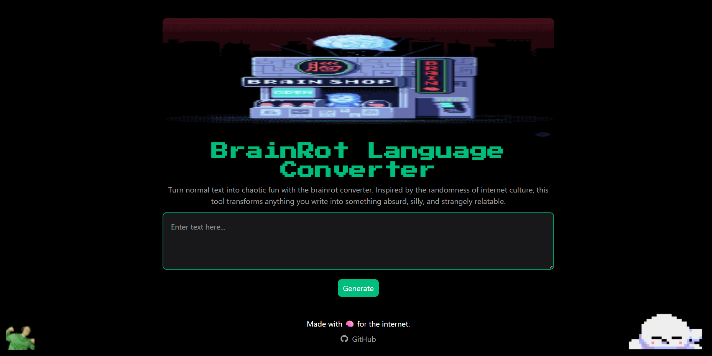

# 🧠 Brainrot Convertor

**Brainrot Convertor** is a quirky web tool that transforms normal text into chaotic, internet-brain nonsense — perfect for meme culture, Gen Z slang, and maximum online absurdity.


## 📸 Demo

  


## 🛠️ Tech Stack

- **Frontend:** [React](https://reactjs.org/), [TailwindCSS](https://tailwindcss.com/)
- **Backend:** Private / Internal (not part of this repository)


## 📦 Installation

```bash
# Clone the repository
git clone https://github.com/stvy2346/brainrot-convert.git
cd brainrot-convertor

# Install frontend dependencies
npm install

# Start the development server
npm run dev
```

## 🌐 Live
🚀[Check out the live version here](https://brainrotconvertor.netlify.app/)